# LocalScribe Program Architecture

> **Maintainability Note**: This document uses [Mermaid](https://mermaid.js.org/) diagrams for easy updates. When the codebase changes, update the relevant diagram section. Most Markdown viewers (GitHub, VS Code, Obsidian) render Mermaid natively.

## Quick Navigation

- [High-Level Overview](#high-level-overview)
- [User Interface Layer](#user-interface-layer)
- [Processing Pipeline](#processing-pipeline)
- [Multi-Document Summarization Pipeline](#multi-document-summarization-pipeline)
- [AI Integration Layer](#ai-integration-layer)
- [Vocabulary Extraction System](#vocabulary-extraction-system)
- [Parallel Processing Architecture](#parallel-processing-architecture)
- [Configuration & Settings](#configuration--settings)
- [Complete Data Flow](#complete-data-flow-diagram)
- [File Directory](#file-directory-quick-reference)

---

## High-Level Overview

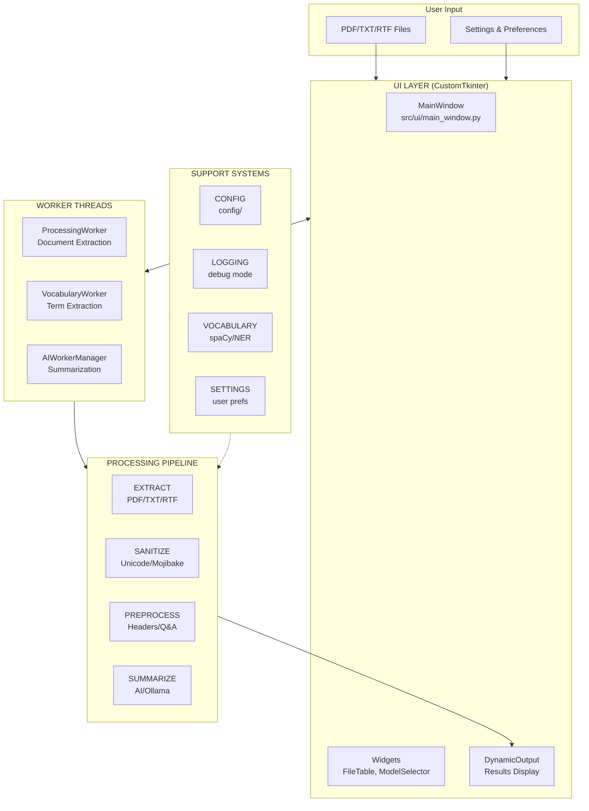

### Core Design Principles

| Principle | Implementation |
|-----------|----------------|
| **Separation of Concerns** | UI, messaging, workflow, and processing are decoupled |
| **Non-blocking UI** | All heavy processing in background threads/processes |
| **Parallel Processing** | Strategy Pattern enables swappable execution modes |
| **Graceful Degradation** | Fallbacks at every stage if components fail |
| **Dependency Injection** | All major components accept optional adapters for testing |

---

## User Interface Layer

### MainWindow Structure

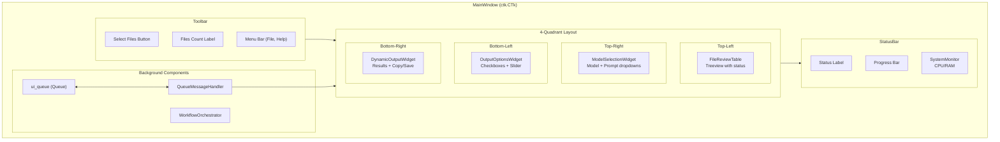

### UI Component Hierarchy

| Component | Location | Purpose |
|-----------|----------|---------|
| `MainWindow` | `src/ui/main_window.py` | Central UI coordinator |
| `FileReviewTable` | `src/ui/widgets.py` | File list with status/confidence |
| `ModelSelectionWidget` | `src/ui/widgets.py` | Model + prompt dropdown selection |
| `OutputOptionsWidget` | `src/ui/widgets.py` | Output toggles + word count slider |
| `DynamicOutputWidget` | `src/ui/dynamic_output.py` | Tabbed results display |
| `SystemMonitor` | `src/ui/system_monitor.py` | CPU/RAM usage display |
| `QueueMessageHandler` | `src/ui/queue_message_handler.py` | Routes worker messages to UI |
| `WorkflowOrchestrator` | `src/ui/workflow_orchestrator.py` | Processing state machine |

### Message Flow

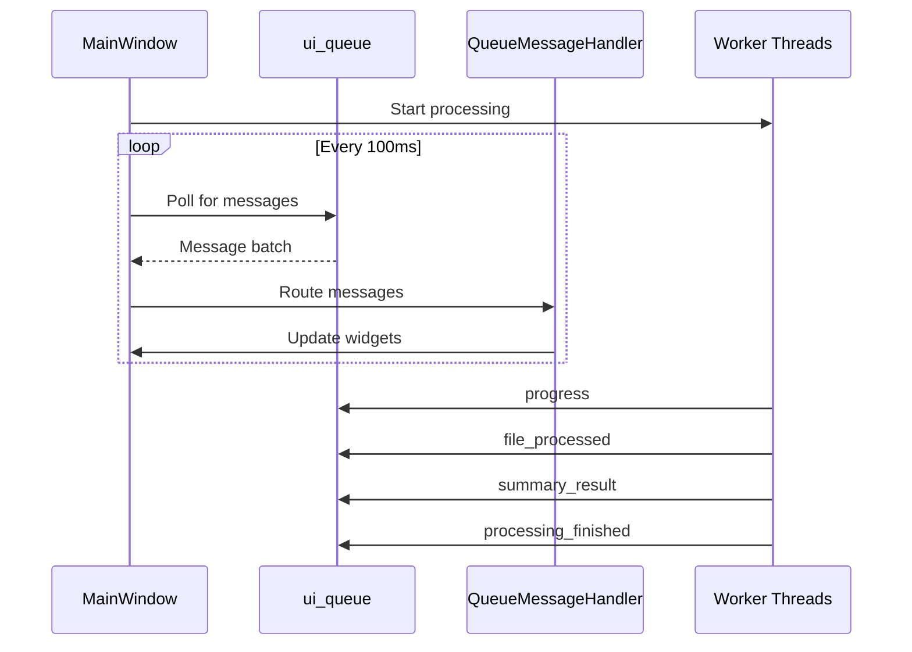

**Message Types:**
- `progress` → Progress bar + status label
- `file_processed` → FileReviewTable row update
- `processing_finished` → WorkflowOrchestrator.on_extraction_complete()
- `vocab_csv_generated` → DynamicOutputWidget vocabulary tab
- `summary_result` → DynamicOutputWidget summary tab
- `multi_doc_result` → DynamicOutputWidget (all summaries)
- `error` → Error dialog + UI reset

---

## Processing Pipeline

### Document Processing Stages

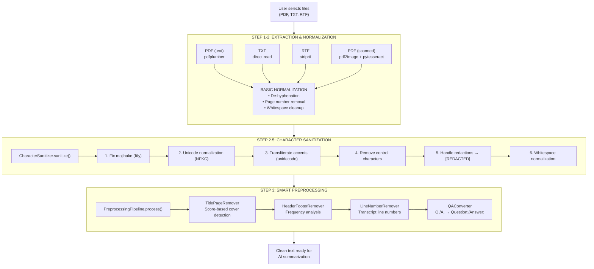

**File Locations:**
- Extraction: `src/extraction/raw_text_extractor.py`
- Sanitization: `src/sanitization/character_sanitizer.py`
- Preprocessing: `src/preprocessing/` (pipeline.py, title_page_remover.py, etc.)

---

## Multi-Document Summarization Pipeline

### Overview: Thread-Through Focus Architecture

This is the core innovation - user's focus areas are threaded through every stage.

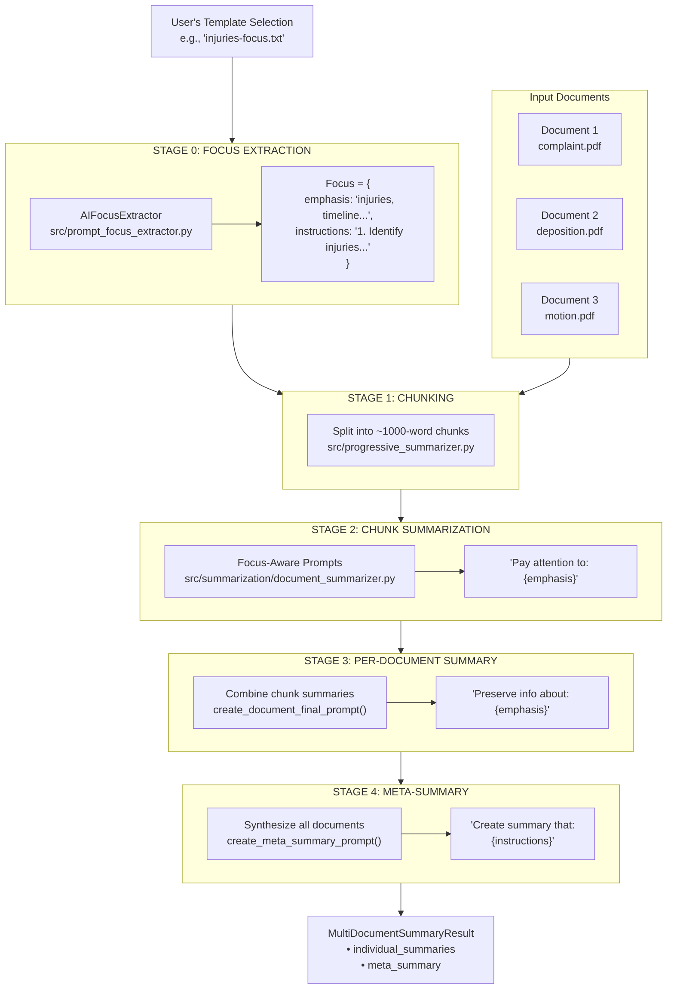

### Focus Threading Summary

| Stage | What's Used | Purpose |
|-------|-------------|---------|
| **Focus Extraction** | Full template content | AI extracts emphasis + instructions |
| **Chunk Prompts** | `emphasis` string | Capture focus-related details early |
| **Document Final** | `emphasis` string | Preserve focus info in doc summary |
| **Meta-Summary** | `instructions` list | Structure final output per user's needs |

### Actual Prompt Templates

#### Chunk Summarization Prompt (Stage 2)

```
<|system|>
You are a legal case summarizer analyzing sections of a long document.
Your summaries will be combined to create overview.
<|end|>
<|user|>
DOCUMENT CONTEXT: {progressive_summary_so_far}
PREVIOUS SECTION: {previous_chunk_summary}

Summarize this section in approximately 75 words.

Focus on key facts, developments, and decisions.
Pay particular attention to: {focus.emphasis}  ← USER'S FOCUS

Preserve any information related to these focus areas.

SECTION TEXT: {chunk_text}
<|end|>
<|assistant|>
```

#### Document Final Summary Prompt (Stage 3)

```
<|system|>
You are creating a comprehensive summary of a legal document.
<|end|>
<|user|>
Create a 200-word summary of "{filename}" from these sections.

Pay particular attention to: {focus.emphasis}  ← USER'S FOCUS

Preserve any information related to these focus areas.
Present in logical, chronological order where possible.

SECTION SUMMARIES:
{all_chunk_summaries_joined}
<|end|>
<|assistant|>
```

#### Meta-Summary Prompt (Stage 4)

```
<|system|>
You are a legal document analyst reviewing summaries of {doc_count}
documents from a single case.
<|end|>
<|user|>
Individual document summaries:

--- complaint.pdf ---
{document_1_summary}

--- deposition.pdf ---
{document_2_summary}

Create a comprehensive meta-summary (350-500 words) that:
{focus.instructions}  ← FULL INSTRUCTIONS FROM USER'S TEMPLATE

Present in logical, chronological order where appropriate.
Synthesize information across documents.
<|end|>
<|assistant|>
```

### Caching Strategy

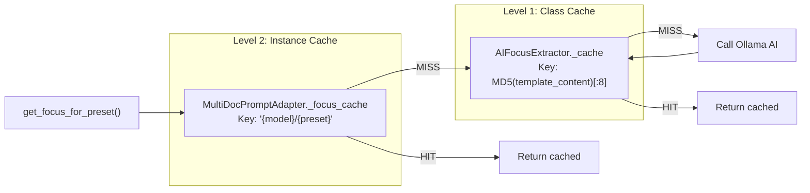

**Why content hash?** If user edits their template file, the hash changes and focus is re-extracted. The `preset_id` alone wouldn't detect file changes.

---

## AI Integration Layer

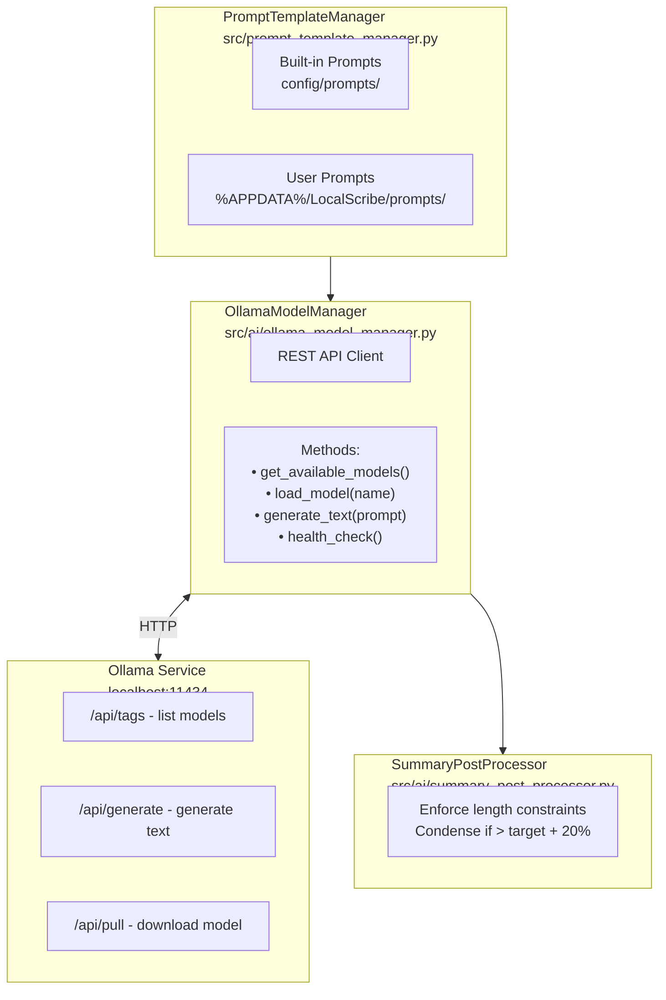

**Configuration (from `src/config.py`):**
- `OLLAMA_API_BASE = "http://localhost:11434"`
- `OLLAMA_CONTEXT_WINDOW = 2048` tokens
- `OLLAMA_TIMEOUT_SECONDS = 600`

---

## Vocabulary Extraction System

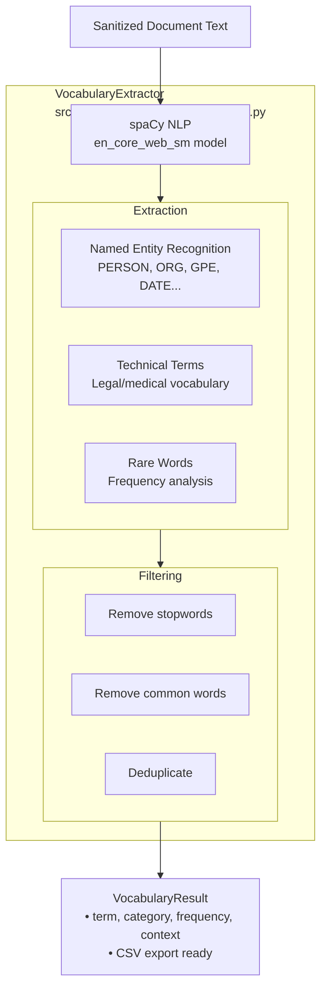

**Categories Extracted:**
- **PERSON**: Names of individuals
- **ORG**: Organizations, companies
- **GPE**: Geographic locations
- **DATE**: Dates and time expressions
- **LEGAL**: Legal terms (plaintiff, defendant, motion)
- **MEDICAL**: Medical terminology
- **TECHNICAL**: Domain-specific terms
- **UNKNOWN**: Rare words not categorized

---

## Parallel Processing Architecture

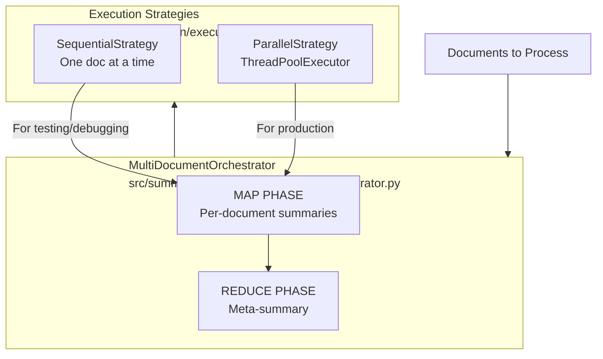

**Strategy Selection:**
- `SequentialStrategy`: Processes one document at a time (safer, easier to debug)
- `ParallelStrategy`: Uses ThreadPoolExecutor for concurrent processing (faster)

---

## Configuration & Settings

### Configuration Files

| File | Purpose |
|------|---------|
| `config/settings.json` | Runtime settings (Ollama URL, timeouts) |
| `config/chunking_config.yaml` | Chunking parameters (words per chunk, overlap) |
| `config/prompts/{model}/` | Model-specific prompt templates |
| `config/vocabulary_settings.yaml` | Vocabulary extraction settings |

### User Settings Location

```
%APPDATA%/LocalScribe/
├── settings.json          # User preferences
├── prompts/               # Custom prompt templates
│   └── phi-3-mini/
│       └── my-custom.txt
└── logs/                  # Debug logs (if enabled)
```

### Settings GUI

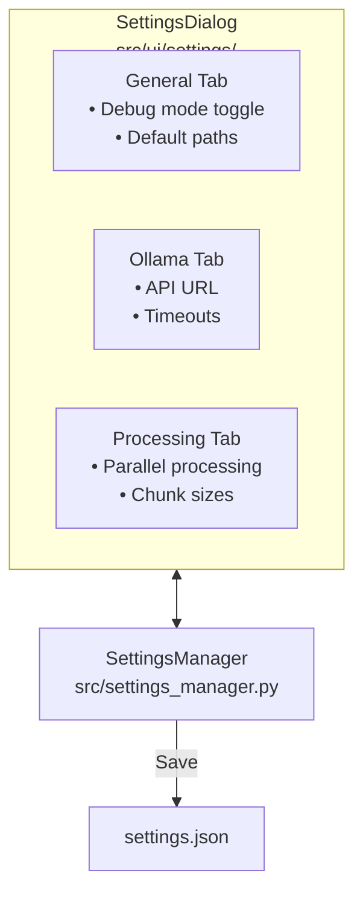

---

## Complete Data Flow Diagram

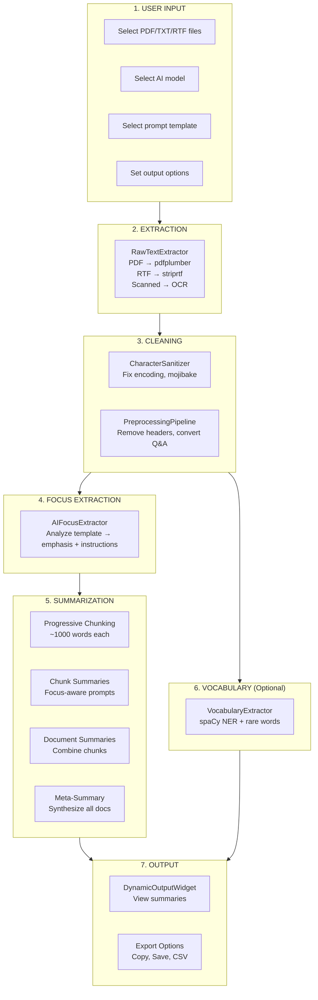

---

## File Directory Quick Reference

### Core Application

| File | Purpose |
|------|---------|
| `src/main.py` | Application entry point |
| `src/config.py` | Global configuration constants |
| `src/logging_config.py` | Debug logging setup |
| `src/settings_manager.py` | User preferences management |

### Extraction & Processing

| File | Purpose |
|------|---------|
| `src/extraction/raw_text_extractor.py` | PDF/TXT/RTF text extraction |
| `src/sanitization/character_sanitizer.py` | Unicode normalization, mojibake fixes |
| `src/preprocessing/pipeline.py` | Preprocessing pipeline orchestrator |
| `src/preprocessing/title_page_remover.py` | Cover page detection/removal |
| `src/preprocessing/header_footer_remover.py` | Repeated header/footer removal |
| `src/preprocessing/line_number_remover.py` | Transcript line number removal |
| `src/preprocessing/qa_converter.py` | Q./A. to Question:/Answer: conversion |

### AI & Summarization

| File | Purpose |
|------|---------|
| `src/ai/ollama_model_manager.py` | Ollama REST API client |
| `src/prompt_template_manager.py` | Prompt template loading/management |
| `src/prompt_focus_extractor.py` | AI-based focus area extraction |
| `src/prompt_adapters.py` | Stage-specific prompt generation |
| `src/progressive_summarizer.py` | Chunking and progressive context |
| `src/summarization/document_summarizer.py` | Single document summarization |
| `src/summarization/multi_document_orchestrator.py` | Multi-doc coordination |
| `src/summarization/execution_strategies.py` | Sequential/parallel execution |
| `src/summarization/result_types.py` | Result dataclasses |
| `src/ai/summary_post_processor.py` | Length enforcement |

### Vocabulary

| File | Purpose |
|------|---------|
| `src/vocabulary/vocabulary_extractor.py` | spaCy-based term extraction |

### User Interface

| File | Purpose |
|------|---------|
| `src/ui/main_window.py` | Central UI coordinator |
| `src/ui/quadrant_builder.py` | 4-quadrant layout construction |
| `src/ui/widgets.py` | FileTable, ModelSelector, OutputOptions |
| `src/ui/workers.py` | ProcessingWorker, VocabularyWorker, etc. |
| `src/ui/workflow_orchestrator.py` | Processing state machine |
| `src/ui/queue_message_handler.py` | Worker → UI message routing |
| `src/ui/dynamic_output.py` | Results display widget |
| `src/ui/system_monitor.py` | CPU/RAM usage display |
| `src/ui/settings/` | Settings dialog components |

---

## Updating This Document

When making changes to LocalScribe:

1. **New component added?** Add to the relevant section's Mermaid diagram
2. **File moved/renamed?** Update the File Directory table
3. **New message type?** Add to Message Flow section
4. **Processing stage changed?** Update the Complete Data Flow diagram

Mermaid diagrams can be previewed in:
- GitHub (native support)
- VS Code (with Markdown Preview Mermaid extension)
- [Mermaid Live Editor](https://mermaid.live/)

---

*This document serves as the architectural reference for LocalScribe. Last updated: Session 21 (2025-11-29)*
