# LocalScribe Program Architecture

> **Maintainability Note**: This document uses [Mermaid](https://mermaid.js.org/) diagrams for easy updates. When the codebase changes, update the relevant diagram section. Most Markdown viewers (GitHub, VS Code, Obsidian) render Mermaid natively.

## Quick Navigation

- [High-Level Overview](#high-level-overview)
- [User Interface Layer](#user-interface-layer)
- [Processing Pipeline](#processing-pipeline)
- [Multi-Document Summarization Pipeline](#multi-document-summarization-pipeline)
- [AI Integration Layer](#ai-integration-layer)
- [Q&A System](#qa-system)
- [Vocabulary Extraction System](#vocabulary-extraction-system)
- [Parallel Processing Architecture](#parallel-processing-architecture)
- [Configuration & Settings](#configuration--settings)
- [Complete Data Flow](#complete-data-flow-diagram)
- [File Directory](#file-directory-quick-reference)

---

## High-Level Overview


### Core Design Principles

| Principle | Implementation |
|-----------|----------------|
| **Separation of Concerns** | UI, messaging, workflow, and processing are decoupled |
| **Non-blocking UI** | All heavy processing in background threads/processes |
| **Parallel Processing** | Strategy Pattern enables swappable execution modes |
| **Graceful Degradation** | Fallbacks at every stage if components fail |
| **Dependency Injection** | All major components accept optional adapters for testing |
| **Pluggable Algorithms** | Registry pattern for vocabulary extraction algorithms |

---

## User Interface Layer

### MainWindow Structure

```mermaid
flowchart TB
    subgraph MainWindow["MainWindow (ctk.CTk)"]
        subgraph Toolbar
            SelectFiles["Select Files Button"]
            FileCount["Files Count Label"]
            MenuBar["Menu Bar (File, Help)"]
        end

        subgraph Quadrants["4-Quadrant Layout"]
            subgraph TL["Top-Left"]
                FileTable["FileReviewTable<br/>Treeview with status"]
            end
            subgraph TR["Top-Right"]
                ModelSelect["ModelSelectionWidget<br/>Model + Prompt dropdowns"]
            end
            subgraph BL["Bottom-Left"]
                OutputOpts["OutputOptionsWidget<br/>Checkboxes + Slider"]
            end
            subgraph BR["Bottom-Right"]
                DynamicOut["DynamicOutputWidget<br/>Summary/Vocab/Q&A tabs"]
            end
        end

        subgraph StatusBar
            StatusLabel["Status Label"]
            ProcessingTimer["Processing Timer"]
            SysMon["SystemMonitor<br/>CPU/RAM"]
        end

        subgraph Background["Background Components"]
            Queue["ui_queue (Queue)"]
            Handler["QueueMessageHandler"]
            Orchestrator["WorkflowOrchestrator"]
        end
    end

    Toolbar --> Quadrants
    Quadrants --> StatusBar
    Queue <--> Handler
    Handler --> Quadrants
```



### UI Component Hierarchy

| Component | Location | Purpose |
|-----------|----------|---------|
| `MainWindow` | `src/ui/main_window.py` | Central UI coordinator |
| `FileReviewTable` | `src/ui/widgets.py` | File list with status/confidence |
| `ModelSelectionWidget` | `src/ui/widgets.py` | Model + prompt dropdown selection |
| `OutputOptionsWidget` | `src/ui/widgets.py` | Output toggles + word count slider |
| `DynamicOutputWidget` | `src/ui/dynamic_output.py` | Tabbed results display (Summary/Vocab/Q&A) |
| `QAPanel` | `src/ui/qa_panel.py` | Q&A results with toggle list |
| `QAQuestionEditor` | `src/ui/qa_question_editor.py` | Edit default Q&A questions |
| `SystemMonitor` | `src/ui/system_monitor.py` | CPU/RAM usage display |
| `ProcessingTimer` | `src/ui/processing_timer.py` | Elapsed time display |
| `QueueMessageHandler` | `src/ui/queue_message_handler.py` | Routes worker messages to UI |
| `WorkflowOrchestrator` | `src/ui/workflow_orchestrator.py` | Processing state machine |

### Message Flow


**Message Types:**

| Message | Handler | UI Update |
|---------|---------|-----------|
| `progress` | `handle_progress()` | Progress bar + status label |
| `file_processed` | `handle_file_processed()` | FileReviewTable row update |
| `processing_finished` | `handle_processing_finished()` | WorkflowOrchestrator.on_extraction_complete() |
| `vocab_csv_generated` | `handle_vocab_csv_generated()` | DynamicOutputWidget vocabulary tab |
| `summary_result` | `handle_summary_result()` | DynamicOutputWidget summary tab |
| `multi_doc_result` | `handle_multi_doc_result()` | DynamicOutputWidget (all summaries) |
| `qa_complete` | `handle_qa_complete()` | DynamicOutputWidget Q&A tab + QAPanel |
| `qa_followup_result` | `handle_qa_followup_result()` | Append to Q&A results |
| `qa_error` | `handle_qa_error()` | Error display |
| `error` | `handle_error()` | Error dialog + UI reset |

---

## Processing Pipeline

### Document Processing Stages


**File Locations:**
- Extraction: `src/extraction/raw_text_extractor.py`
- Sanitization: `src/sanitization/character_sanitizer.py`
- Preprocessing: `src/preprocessing/` (pipeline.py, title_page_remover.py, etc.)

---

## Multi-Document Summarization Pipeline

### Overview: Thread-Through Focus Architecture

This is the core innovation - user's focus areas are threaded through every stage.


### Focus Threading Summary

| Stage | What's Used | Purpose |
|-------|-------------|---------|
| **Focus Extraction** | Full template content | AI extracts emphasis + instructions |
| **Chunk Prompts** | `emphasis` string | Capture focus-related details early |
| **Document Final** | `emphasis` string | Preserve focus info in doc summary |
| **Meta-Summary** | `instructions` list | Structure final output per user's needs |

### Caching Strategy


**Why content hash?** If user edits their template file, the hash changes and focus is re-extracted. The `preset_id` alone wouldn't detect file changes.

---

## AI Integration Layer


**Configuration (from `src/config.py`):**
- `OLLAMA_API_BASE = "http://localhost:11434"`
- `OLLAMA_CONTEXT_WINDOW = 2048` tokens
- `OLLAMA_TIMEOUT_SECONDS = 600`

---

## Q&A System

### Overview

The Q&A system enables users to ask questions about processed documents using **hybrid retrieval** (BM25+ lexical + FAISS semantic search).

**Unified API (Session 32):** All Q&A functionality is accessible from `src.qa`:
```python
from src.qa import (
    QAOrchestrator, QAResult, AnswerGenerator, AnswerMode,  # Orchestration
    VectorStoreBuilder, QARetriever, QuestionFlowManager,   # Storage
    HybridRetriever, ChunkMerger,                           # Retrieval
)
```


### Q&A Architecture Components

| Component | Location | Purpose |
|-----------|----------|---------|
| `VectorStoreBuilder` | `src/vector_store/vector_store_builder.py` | Creates FAISS indexes from document text |
| `QARetriever` | `src/vector_store/qa_retriever.py` | Retrieves context using hybrid search |
| `HybridRetriever` | `src/retrieval/hybrid_retriever.py` | Coordinates BM25+ and FAISS algorithms |
| `BM25PlusRetriever` | `src/retrieval/algorithms/bm25_plus.py` | Lexical/keyword-based search |
| `FAISSRetriever` | `src/retrieval/algorithms/faiss_semantic.py` | Semantic/embedding-based search |
| `ChunkMerger` | `src/retrieval/chunk_merger.py` | Weighted result combination |
| `QAOrchestrator` | `src/qa/qa_orchestrator.py` | Coordinates question loading, retrieval, answer generation |
| `AnswerGenerator` | `src/qa/answer_generator.py` | Generates answers (extraction or Ollama mode) |
| `QAResult` | `src/qa/__init__.py` | Dataclass for question/answer/confidence/sources |
| `QAPanel` | `src/ui/qa_panel.py` | UI panel with toggle list and follow-up input |
| `QAQuestionEditor` | `src/ui/qa_question_editor.py` | Modal dialog for editing default questions |
| `QAWorker` | `src/ui/workers.py` | Background thread for Q&A processing |

### Hybrid Retrieval Architecture (Session 31)

Why hybrid? The FAISS semantic search alone was returning "no information found" because the embedding model (`all-MiniLM-L6-v2`) isn't trained on legal terminology. BM25+ provides exact keyword matching as a complement.


**Configuration (`src/config.py`):**
```python
RETRIEVAL_ALGORITHM_WEIGHTS = {"BM25+": 1.0, "FAISS": 0.5}
RETRIEVAL_MIN_SCORE = 0.1  # Lowered from 0.5
RETRIEVAL_MULTI_ALGO_BONUS = 0.1
```

### Answer Generation Modes


**Mode Selection:** Configured in Settings → Q&A tab. Extraction mode is faster but less sophisticated; Ollama mode provides synthesized answers but requires Ollama running.

### Default Questions Flow


---

## Vocabulary Extraction System

### Multi-Algorithm Architecture (Session 25+)

```mermaid
flowchart TB
    Input["Sanitized Document Text"]

    subgraph VocabExtractor["VocabularyExtractor<br/>src/vocabulary/vocabulary_extractor.py"]
        subgraph Algorithms["PLUGGABLE ALGORITHMS"]
            NER["NERAlgorithm<br/>spaCy en_core_web_lg<br/>Weight: 1.0"]
            RAKE["RAKEAlgorithm<br/>rake-nltk<br/>Weight: 0.7"]
            BM25["BM25Algorithm<br/>Corpus-based TF-IDF<br/>Weight: 0.8"]
        end

        subgraph Merger["RESULT MERGER"]
            Merge["ResultMerger<br/>Weighted confidence combination"]
            Dedupe["Deduplication<br/>Substring filtering"]
        end

        subgraph Feedback["ML FEEDBACK SYSTEM"]
            FeedbackMgr["FeedbackManager<br/>CSV storage"]
            MetaLearner["VocabularyMetaLearner<br/>Logistic regression"]
        end
    end

    subgraph Output["OUTPUT"]
        Results["VocabularyResult[]<br/>• term, type, role<br/>• confidence, quality_score<br/>• algorithm_source"]
        CSV["CSV Export"]
        Table["UI Table with 👍/👎"]
    end

    Input --> Algorithms
    Algorithms --> Merger
    Merger --> Feedback
    Feedback --> Output
```



### Algorithm Registry Pattern


**Adding a new algorithm:**
```python
@register_algorithm
class MyNewAlgorithm(BaseAlgorithm):
    name = "my_algorithm"
    weight = 0.6

    def extract(self, text: str) -> AlgorithmResult:
        # Implementation
        pass
```

### Algorithm Components

| Component | Location | Purpose |
|-----------|----------|---------|
| `BaseAlgorithm` | `src/vocabulary/algorithms/base.py` | ABC for all algorithms |
| `CandidateTerm` | `src/vocabulary/algorithms/base.py` | Dataclass for extracted terms |
| `NERAlgorithm` | `src/vocabulary/algorithms/ner_algorithm.py` | spaCy named entity recognition |
| `RAKEAlgorithm` | `src/vocabulary/algorithms/rake_algorithm.py` | RAKE keyword extraction |
| `BM25Algorithm` | `src/vocabulary/algorithms/bm25_algorithm.py` | Corpus-based TF-IDF scoring |
| `ResultMerger` | `src/vocabulary/result_merger.py` | Combines algorithm results |
| `FeedbackManager` | `src/vocabulary/feedback_manager.py` | Stores user 👍/👎 feedback |
| `VocabularyMetaLearner` | `src/vocabulary/meta_learner.py` | Learns user preferences |
| `CorpusManager` | `src/vocabulary/corpus_manager.py` | Manages BM25 corpus folder |

### BM25 Corpus System


**Activation:** BM25 auto-enables when corpus folder contains ≥5 documents. User can disable in Settings.

### ML Feedback Learning

```mermaid
flowchart TB
    subgraph UserAction["User Feedback"]
        ThumbsUp["👍 Good term"]
        ThumbsDown["👎 Bad term"]
    end

    subgraph Storage["FeedbackManager"]
        CSV["feedback.csv<br/>%APPDATA%/LocalScribe/data/feedback/"]
    end

    subgraph Training["VocabularyMetaLearner"]
        Features["Features:<br/>• quality_score<br/>• frequency metrics<br/>• algorithm flags<br/>• type one-hot"]
        Model["Logistic Regression"]
        Threshold["Training threshold: 30 samples"]
    end

    subgraph Application["Score Adjustment"]
        Boost["Boost/penalize<br/>future extractions"]
    end

    UserAction --> Storage
    Storage --> Training
    Training --> Application
```



**Training triggers:**
- Initial training: 30 feedback samples
- Retrain: Every 10 new samples

---

## Parallel Processing Architecture


**Strategy Selection:**
- `SequentialStrategy`: Processes one document at a time (safer, easier to debug)
- `ThreadPoolStrategy`: Uses ThreadPoolExecutor for concurrent processing (2.5-3x faster)

**Worker Count:** `min(cpu_count, 4)` - Auto-detects CPU cores but caps at 4 for memory safety

---

## Configuration & Settings

### Configuration Files

| File | Purpose |
|------|---------|
| `config/settings.json` | Runtime settings (Ollama URL, timeouts) |
| `config/chunking_config.yaml` | Chunking parameters (words per chunk, overlap) |
| `config/prompts/{model}/` | Model-specific prompt templates |
| `config/qa_questions.yaml` | Default Q&A questions |
| `config/common_medical_legal.txt` | Vocabulary blacklist |

### User Data Location

```
%APPDATA%/LocalScribe/
├── settings.json          # User preferences
├── prompts/               # Custom prompt templates
│   └── phi-3-mini/
│       └── my-custom.txt
├── corpus/                # BM25 reference corpus
│   └── *.pdf, *.txt, *.rtf
├── vector_stores/         # FAISS indexes (per-session)
│   └── {hash}.faiss
├── data/
│   └── feedback/          # ML feedback CSV files
│       └── feedback.csv
└── logs/                  # Debug logs (if enabled)
```

### Settings GUI

```mermaid
flowchart TB
    subgraph SettingsDialog["SettingsDialog<br/>src/ui/settings/"]
        PerformanceTab["Performance Tab<br/>• Auto-detect CPU<br/>• Worker count<br/>• CPU allocation"]
        SummarizationTab["Summarization Tab<br/>• Default word count"]
        VocabTab["Vocabulary Tab<br/>• Display limit<br/>• Sort by rarity<br/>• Corpus settings"]
        QATab["Q&A Tab<br/>• Answer mode<br/>• Auto-run Q&A<br/>• Edit questions"]
    end

    SettingsRegistry["SettingsRegistry<br/>Declarative definitions"]

    SettingsDialog <--> SettingsRegistry
    SettingsRegistry -->|Save| UserPrefs["user_preferences.json"]
```



**Adding a new setting:**
```python
SettingsRegistry.register(SettingDefinition(
    key="my_new_setting",
    label="Enable New Feature",
    category="General",  # Creates new tab if needed
    setting_type=SettingType.CHECKBOX,
    tooltip="Description shown on hover.",
    default=False,
    getter=lambda: prefs.get("my_new_setting", False),
    setter=lambda v: prefs.set("my_new_setting", v),
))
```

---

## Complete Data Flow Diagram


---

## File Directory Quick Reference

### Core Application

| File | Purpose |
|------|---------|
| `src/main.py` | Application entry point |
| `src/config.py` | Global configuration constants |
| `src/logging_config.py` | Debug logging setup |
| `src/user_preferences.py` | User preferences management |

### Extraction & Processing

| File | Purpose |
|------|---------|
| `src/extraction/raw_text_extractor.py` | PDF/TXT/RTF text extraction |
| `src/sanitization/character_sanitizer.py` | Unicode normalization, mojibake fixes |
| `src/preprocessing/__init__.py` | Preprocessing pipeline exports |
| `src/preprocessing/base.py` | BasePreprocessor ABC |
| `src/preprocessing/title_page_remover.py` | Cover page detection/removal |
| `src/preprocessing/header_footer_remover.py` | Repeated header/footer removal |
| `src/preprocessing/line_number_remover.py` | Transcript line number removal |
| `src/preprocessing/qa_converter.py` | Q./A. to Question:/Answer: conversion |

### AI & Summarization

| File | Purpose |
|------|---------|
| `src/ai/ollama_model_manager.py` | Ollama REST API client |
| `src/ai/summary_post_processor.py` | Length enforcement |
| `src/progressive_summarizer.py` | Chunking and progressive context |
| `src/chunking_engine.py` | Text chunking logic |
| `src/summarization/__init__.py` | Summarization package exports |
| `src/summarization/result_types.py` | Result dataclasses |
| `src/summarization/document_summarizer.py` | Single document summarization |
| `src/summarization/multi_document_orchestrator.py` | Multi-doc coordination |

### Prompting System (Session 33)

| File | Purpose |
|------|---------|
| `src/prompting/__init__.py` | Unified prompting API exports |
| `src/prompting/template_manager.py` | Prompt template loading/management |
| `src/prompting/focus_extractor.py` | AI-based focus area extraction |
| `src/prompting/adapters.py` | Stage-specific prompt generation |
| `src/prompting/config.py` | Prompt parameters configuration |

### Q&A System

| File | Purpose |
|------|---------|
| `src/qa/__init__.py` | Unified Q&A API (re-exports vector_store + retrieval) |
| `src/qa/qa_orchestrator.py` | Coordinates Q&A workflow |
| `src/qa/answer_generator.py` | Generates answers (extraction/Ollama) |
| `src/vector_store/__init__.py` | Vector store package exports |
| `src/vector_store/vector_store_builder.py` | Creates FAISS indexes |
| `src/vector_store/qa_retriever.py` | Retrieves context using hybrid search |
| `src/vector_store/question_flow.py` | Branching question tree logic |
| `config/qa_questions.yaml` | Default Q&A questions |

### Hybrid Retrieval (Session 31)

| File | Purpose |
|------|---------|
| `src/retrieval/__init__.py` | Retrieval package exports |
| `src/retrieval/base.py` | ABC and dataclasses for retrieval |
| `src/retrieval/hybrid_retriever.py` | Coordinates BM25+ and FAISS algorithms |
| `src/retrieval/chunk_merger.py` | Weighted result combination |
| `src/retrieval/algorithms/__init__.py` | Algorithm registry |
| `src/retrieval/algorithms/bm25_plus.py` | BM25+ lexical search |
| `src/retrieval/algorithms/faiss_semantic.py` | FAISS semantic search |

### Vocabulary Extraction

| File | Purpose |
|------|---------|
| `src/vocabulary/__init__.py` | Package exports |
| `src/vocabulary/vocabulary_extractor.py` | Main orchestrator (580 lines) |
| `src/vocabulary/role_profiles.py` | Profession-specific role detection |
| `src/vocabulary/result_merger.py` | Combines algorithm results |
| `src/vocabulary/feedback_manager.py` | CSV-based feedback storage |
| `src/vocabulary/meta_learner.py` | Logistic regression meta-learner |
| `src/vocabulary/corpus_manager.py` | BM25 corpus folder management |
| `src/vocabulary/algorithms/__init__.py` | Algorithm registry |
| `src/vocabulary/algorithms/base.py` | ABC and dataclasses |
| `src/vocabulary/algorithms/ner_algorithm.py` | spaCy NER extraction |
| `src/vocabulary/algorithms/rake_algorithm.py` | RAKE keyword extraction |
| `src/vocabulary/algorithms/bm25_algorithm.py` | BM25 corpus-based scoring |

### Parallel Processing

| File | Purpose |
|------|---------|
| `src/parallel/__init__.py` | Parallel package exports |
| `src/parallel/executor_strategy.py` | Strategy interface + implementations |
| `src/parallel/task_runner.py` | Task orchestration |
| `src/parallel/progress_aggregator.py` | Throttled progress updates |

### User Interface

| File | Purpose |
|------|---------|
| `src/ui/main_window.py` | Central UI coordinator (business logic) |
| `src/ui/window_layout.py` | UI layout creation mixin (Session 33) |
| `src/ui/widgets.py` | FileTable, ModelSelector, OutputOptions |
| `src/ui/workers.py` | ProcessingWorker, VocabularyWorker, QAWorker |
| `src/ui/workflow_orchestrator.py` | Processing state machine |
| `src/ui/queue_message_handler.py` | Worker → UI message routing |
| `src/ui/dynamic_output.py` | Results display widget |
| `src/ui/qa_panel.py` | Q&A results panel |
| `src/ui/qa_question_editor.py` | Q&A question editor dialog |
| `src/ui/system_monitor.py` | CPU/RAM usage display |
| `src/ui/processing_timer.py` | Elapsed time display |
| `src/ui/settings/__init__.py` | Settings package exports |
| `src/ui/settings/settings_registry.py` | Declarative setting definitions |
| `src/ui/settings/settings_dialog.py` | Tabbed settings dialog |
| `src/ui/settings/settings_widgets.py` | Custom setting widgets |

### Tests

| File | Purpose |
|------|---------|
| `tests/test_raw_text_extractor.py` | 24 extraction tests |
| `tests/test_character_sanitizer.py` | 22 sanitization tests |
| `tests/test_preprocessing.py` | 16 preprocessing tests |
| `tests/test_vocabulary_extractor.py` | 7 vocabulary tests |
| `tests/test_feedback_ml.py` | 16 feedback/ML tests |
| `tests/test_bm25_algorithm.py` | 20 BM25 tests |
| `tests/test_multi_document_summarization.py` | 16 multi-doc tests |
| `tests/test_prompt_adapters.py` | 22 prompt adapter tests |
| `tests/test_qa_orchestrator.py` | 20 Q&A tests |

---

## Updating This Document

When making changes to LocalScribe:

1. **New component added?** Add to the relevant section's Mermaid diagram
2. **File moved/renamed?** Update the File Directory table
3. **New message type?** Add to Message Flow section
4. **Processing stage changed?** Update the Complete Data Flow diagram
5. **New algorithm?** Add to Vocabulary Extraction section

Mermaid diagrams can be previewed in:
- GitHub (native support)
- VS Code (with Markdown Preview Mermaid extension)
- [Mermaid Live Editor](https://mermaid.live/)

---

*This document serves as the architectural reference for LocalScribe. Last updated: Session 33 (2025-12-01)*
